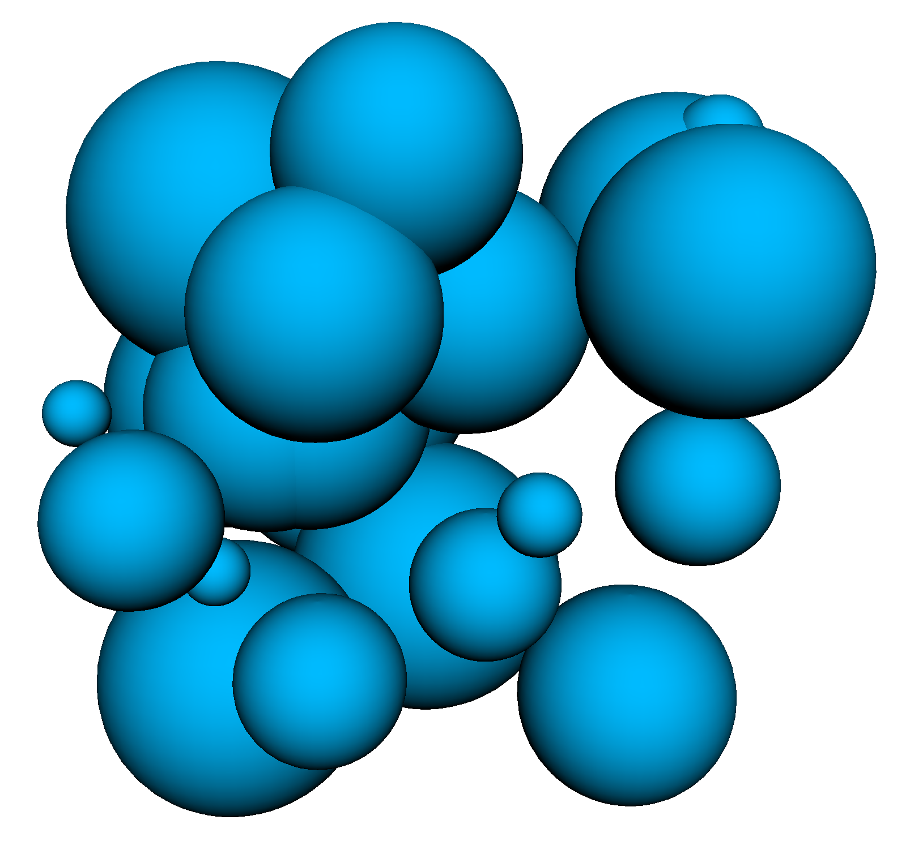
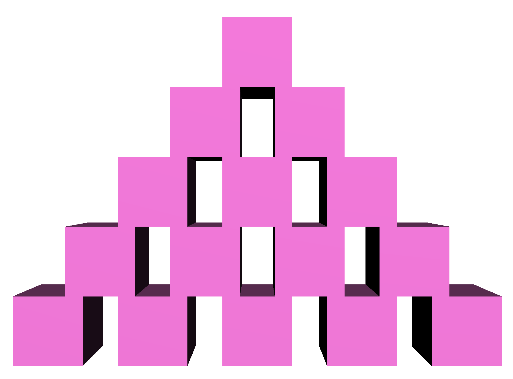
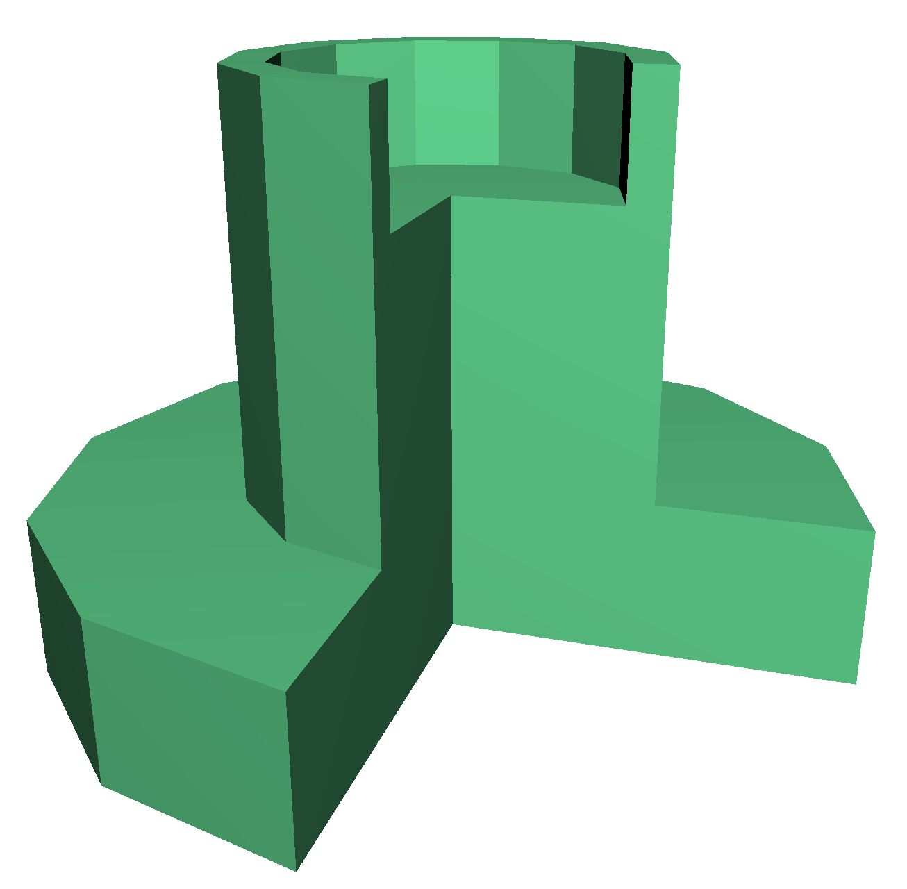
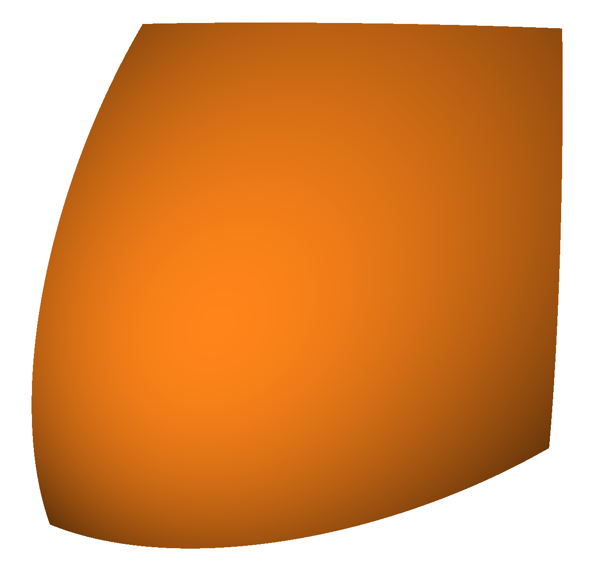
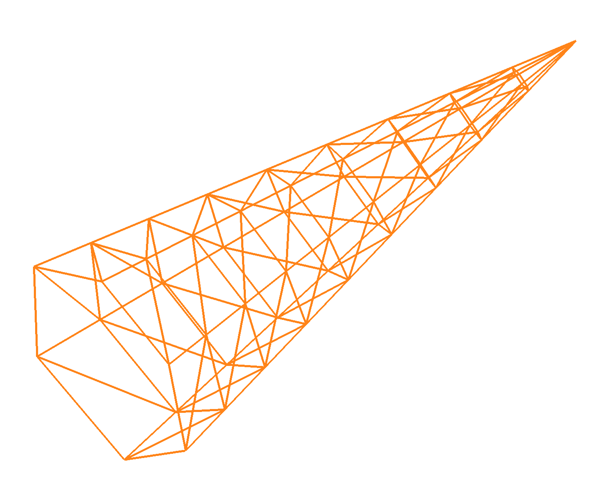

#Madeup
Madeup is a programming language for generating 3D models. It is a language for makings things *up*. Its speakers use commands like `move` and `yaw` to walk through space along the cross sections or skeletons of solid models. They then use commands like `extrude` or `revolve` to generate a solid model. The models can then be printed or imported in another 3D application.

Like any language, Madeup has a grammar and meaning that must be learned in order to express models. This document describes the language so that you can start making things up.

##Generators
We could begin our discussion from the very bottom, starting with the simple rules of the language and building up, but you'd probably start skipping over these important but "unactionable" details until you found something interesting. Instead, let's dive into Madeup with a few examples of its geometry generators. If you haven't programmed before, these code snippets may be intimidating. Skim them for now, and consider this section as a preview of the kinds of objects you can create. You can work on understanding the code later.

For the time being, note this important detail to understand how Madeup behaves: whenever a user issues a `move` and `moveto` command, the visited location is appended to a list of vertices. This list accumulates as the user wanders through space. Later, when one of the following generating commands is issued, the accumulated vertices are given to the generator. Each generator interprets the list in a different way. After the geometry is generated, the list is cleared so that a new shape can be walked along.

###`dot`
The `dot` command generates a sphere at each of the vertices. The number of facets on the sphere is determined by the variable `nsides`. The radius of each sphere is determined by the value of the variable `radius` at the time of the `move` or `moveto`.

{:.center}

{:.mup}
~~~
seed = 92

repeat 30
  radius = random 2, 10
  x = random -20, 20
  y = random -20, 20
  z = random -20, 20
  moveto x, y, z
end

nsides = 50
dot
~~~

Printing completely round objects is a challenge for many 3D printers. You may need scaffolding material or to slice your models in half, print them flat-side-down, and glue them together.

###`box`
The `box` command generates a rectangular prism (or right parallelipiped) at each of the vertices. The side length of each prism is twice the value of the variable `radius` at the time of the `move` or `moveto`.

In the example below, we draw a pyramid of boxes recursively. All have the default `radius`.

{:.center}

{:.mup}
~~~
spacePerBox = 2 + 1

to pyramid row
  if row > 0
    -- put boxes in this row, with gaps
    for column to row
      moveto column * spacePerBox, 0, 0
    end
    
    -- move up the stack with one less box
    translate spacePerBox // 2, 2, 0
    pyramid row - 1
  end
end

pyramid 5
box
~~~

###`extrude x, y, z, length`
The `extrude` command considers the list of vertices to trace the footprint or cross section of an object and extends that cross section along axis \[`x`, `y`, `z`\] for `length` units. The vertices are assumed all be in the same plane. Parameter `length` may be any number.

{:.center}

{:.mup}
~~~
moveto 0, 0, 0

repeat 5
  move 10
  yaw 144
  move 10
  yaw -72
end

extrude 0, 0, 1, 3
~~~

The path between does not need to be explicitly closed, that is, you do not need to revisit the starting vertex at the end of your path. However, it is legal to do so, as is done in the example above. If you do not revisit it explicitly, the path will be implicitly closed to avoid generating a non-solid object.

###`revolve x, y, z, degrees`
The `revolve` command considers the list of vertices to trace the cross section of an object and spins the cross section around axis \[`x`, `y`, `z`\] for the specified number of `degrees`. The vertices are assumed all be in the same plane. Parameter `degrees` may be any number.

{:.center}

{:.mup}
~~~
yaw 90
moveto 0, 0, 0
move 10
yaw -90
move 4
yaw -90
move 5
yaw 90
move 10
yaw -90
move 1
yaw -90
move 3
yaw 90
move 4

nsides = 10
revolve 0, 1, 0, 270
~~~

The path between does not need to be explicitly closed, that is, you do not need to revisit the starting vertex at the end of your path. However, it is legal to do so, as is done in the example above. If you do not revisit it explicitly, two things may happen. If both the start and final vertices are on the axis of revolution, the path will remain open. Otherwise, the path will be implicitly closed to avoid generating a non-solid object.

###`polygon`

The `polygon` command considers the list of vertices to trace the outline of a planar polygon.

{:.center}

{:.mup}
~~~
-- Walk through degrees of circle.
for i through 360 by 40
  -- Turn polar coordinates into Cartesian.
  x = cos i
  y = sin i
  moveto x, y, 0
end

polygon
~~~

Polygons are not solid objects and are therefore not printable. However, this generator may still be useful for testing your paths before using them with more advanced generators.

###`forget`
The `forget` command is not really a generator. Instead, it discards the list of vertices. This command can be used to temporarily disable some geometry.

{:.center}

{:.mup}
~~~
repeat 1000
  x = random 0, 100
  y = random 0, 100
  z = random 0, 100
  moveto x, y, z
end

-- dot
forget

-- other independent code
~~~

###`surface width, height`
The `surface` command considers the list of vertices to enumerate an `m` by `n` grid-structured mesh. The first vertex describes the mesh position at row 0, column 0. The second vertex describes the mesh position at row 0, column 1. The `n`th vertex describes the mesh position at row 1, column 0. Neighboring mesh vertices form the faces of the generated model.

This generator supports the definition of 2D parametric surfaces like spheres, cones, cylinders, planes, Mobius strips, and so on. The model produced is solid only if the right column of vertices coincide with the left column, and the bottom row coincides with the top row.

{:.center}

{:.mup}
~~~
for r to 100
  for c to 100
    deltaC = c - 20
    deltaR = r - 20
    distance = deltaC ^ 2 + deltaR ^ 2
    moveto c, r, distance * -0.01
  end
end

surface 100, 100
~~~

In the example below, we see the underlying 7 by 10 grid structure of a cone. Iterator `c` visits angles 0, 60, 120, 180, 240, 300, and 360. The first and last columns coincide, so the mesh is closed horizontally.

{:.center}

{:.mup}
~~~
for r to 10
  for c through 360 by 60
    scale = 1 - r // 9
    x = scale * cos (-c)
    y = 0.5 * r
    z = scale * sin (-c)
    moveto x, y, z
  end
end

surface 7, 10
~~~

##Language Reference
Every fun thing that has ever happened started with some rules (gravitational law, oldest player rolls first, etc.), and Madeup is no exception. Let's describe the grammar of the Madeup language.

###Comments
Code is mixture of executable instructions and notes for the humans working with the code. The notes are called comments and they start with `--`:

{:.mup}
~~~
-- This program generates a rocket ship.
-- It will fly.
-- Someday.

generateRocketShip -- hide the ugly details
~~~

Comments can appear on their own line or at the end of lines containing instructions.

###Expressions
Madeup programs are built out of expressions, utterances that yield some value. Almost every construct of Madeup is an expression, but not all provide meaningful values that can be chained together to form compound expressions. Like `yaw`. A `yaw` command yields `nothing` and will almost always appear by itself.

In this section, we focus on expressions that do yield meaningful values. Such expressions can be assembled together to produce more interesting values. When multiple expressions appear on a line, we must decide which one gets evaluated first. In 5 + 3 * 8, the convention of mathematical precedence tells us to multiply first. This yields the intermediate expression `5 + 24`. After evaluating the remaining operation, we get the expression's final value of `29`.

The expressions that Madeup supports are listed below from highest precedence to lowest.

####Literals
The simplest expressions in the Madeup language describe raw integers, real numbers, logical notions called booleans, or strings of text. Here are few literal expressions of various types:

{:.mup}
~~~
6.7 -- real
2 -- integer
"i: " -- string
true -- boolean
false -- boolean
nothing -- the not-a-thing
~~~

####Association (`(expr)`)
Expressions can be surrounded by parentheses to help control the order of evaluation or to emphasize grouping:

{:.mup}
~~~
print (5 + 3) * 8
~~~

Note that unlike many programming languages, parentheses do not surround function parameter lists. Given Madeup's spare use of punctuation, parentheses are often needed to enforce unary negation, as in:

{:.mup}
~~~
x = cos (-theta)
~~~

The alternative

{:.mup}
~~~
x = cos -theta
~~~

is interpreted as subtraction: the value of `theta` is being taken away from the value of `cos`.

####Absolute Value (`|expr|`)
Find the absolution value of an expression by surrounding it with pipe (`|`) characters:

{:.mup}
~~~
x = -3.14
print |x + 1| -- prints 2.14
~~~

Note that nesting absolute value expressions is illegal:

{:.mup}
~~~
x = -3.14
print |x + |-1|| -- illegal
~~~

####Indexing and Selection (`[i]`, `.length`)
Index into an array with `[]`, the subscript operator. The index expression `i` must yield an integer. Query an array's length with `.length`.

{:.mup}
~~~
counts = 10 of 0
counts[0] = 17
counts[9] = 32
print counts.length -- prints 10
counts[10] = 5 -- illegal, out-of-bounds index
~~~

####Logical Negation (`not`)
Flip a boolean expression to its opposite with the `not` operator:

{:.mup}
~~~
print not true -- prints false
x = 15
if not (x < 15)
  print "yes!"
end -- prints yes!
~~~

####Exponential (`^`)
Raise a number to a power with the `^` operator. This operator is left-associative, meaning that in an expression containing multiple `^` operators at the same level of precedence, the leftmost operation will be evaluated first.

The base and exponent are expected to be numbers. If the exponent is less than 1 and the base is negative, by the rules of mathematics, you will get a complex number. By the rules of Madeup, you will get an undefined value.

{:.mup}
~~~
print 5 ^ 3 -- prints 125
print 49 ^ 0.5 -- prints 7
print 2 ^ 3 ^ 2 -- same as (2 ^ 3) ^ 2 = 8 ^ 2 = 64
~~~

####Multiplicative (`*`, `/`, `//`, `%`)
Madeup provides the conventional multiplication and division operators, along with a real division operator and a remainder or modulus operator. The `/` operator yields an integer if its two operands are integers, and a real if at least one of the operands is a real. To ensure a real number result, even if the operands are integers, use `//`. The remainder operation has the form `a % b`, where `a` and `b` are integers. This operation yields the integer remainder of `a / b`.

If both operands are integers, the result is an integer. Otherwise, the result is a real.

{:.mup}
~~~
print 100.7 * 2 -- 201.4
print 7 / 3 -- 2
print 7 / 3.0 -- 2.3333...
print 7 // 3 -- 2.3333...
print 7 % 3 -- 1
~~~

####Additive (`+`, `-`)
Find the sum or difference of two numbers with `+` or `-`. If both operands are integers, the result is an integer. Otherwise, the result is a real.

{:.mup}
~~~
print 100 + -100 -- 0
print 0.7 + 2 -- 2.7
x = 0.3
print 6 - x -- 5.7
~~~

####Relational (`<`, `<=`, `>`, `>=`)
Query the relationship between two numbers with these operators, which yield a boolean value indicating whether or not the relation holds.

{:.mup}
~~~
print 5 < 3 -- false
print 6 <= 6 -- true
print 7 >= 3 -- true
print 2 > -2 -- true
~~~

####Equality (`==`, `!=`)
Query whether two values are the same with the `==` operator. Query whether two values are different with the `!=` operator. These operators can be applied to numbers, booleans, and strings.

{:.mup}
~~~
print 5 == 0 -- false
print true == not false -- true
print 3 / 2 == 3 // 2 -- false
print 5.7 != 5.69 -- true
~~~

####Assignment (`=`)
Bind a value to a name using the `=` operator. This operator is right-associative, meaning that in an expression with multiple `=` operations, the rightmost `=` will be evaluated first.

{:.mup}
~~~
a = b = 3
print a -- 3
print b -- 3
sum = a + b -- sum holds 6
diff = a - b -- diff holds 0
~~~

####Conjunction (`and`)
Query whether two booleans are both true with the `and` operator.

{:.mup}
~~~
if x > 0 and y > 0
  print "in quadrant 1"
end
~~~

####Disjunction (`or`)
Query whether at least one of two booleans is true with the `or` operator.

{:.mup}
~~~
if i < 0 or i >= values.length
  print "bad index"
end
~~~

###Builtin Variables

###User Variables

###Loops

###Conditionals

###Builtin Functions

####`print message`
Print a given message. Message may be a string, number, boolean, or array.

{:.mup}
~~~
print 9 * 7 -- prints "63"
~~~

####`debug message`
Print a given message, preceded by the expression that computes it. Message may be a string, number, boolean, or array.

{:.mup}
~~~
debug 9 * 7 -- prints "9 * 7: 63"
~~~

####`moveto x, y, z`
Move directly to location (`x`, `y`, `z`). The location is transformed by any transform modifiers (such as `rotate`, `scale`, `translate`) that have been previously applied.

####`move length`
Move `length` units along the current heading.

####`yaw degrees`
Alter the current heading by turning right or left the given number of degrees. The direction of the turn depends on the sign of `degrees` and your point of view. If you are looking down on the cursor (and it is pointing up at you) and if degrees is positive, a right turn is made.

####`pitch degrees`
Alter the current heading by flipping forward or backward the given number of degrees. The direction of the turn depends on the sign of `degrees` and your point of view. If you are looking at the back of the cursor and if degrees is positive, the cursor's nose is turned down.

####`roll degrees`
Alter the current heading by rolling right or left the given number of degrees. The direction of the turn depends on the sign of `degrees` and your point of view. If you are looking at the back of the cursor and if degrees is positive, the cursor's left side comes up and its right side comes down.

####`translate x, y, z`
Modify any future movement or generated geometry by shifting it by the given offsets along the x-, y-, and z-axes. This transformation will be applied after any previous modifier. See `identity` to clear the transform modifier.

####`rotate x, y, z, degrees`
Modify any future movement or generated geometry by rotating along the given axis by the given degrees. This transformation will be applied after any previous modifier. See `identity` to clear the transform modifier.

####`scale x, y, z`
Modify any future movement or generated geometry by scaling by the given factors along the x-, y-, and z-axes. This transformation will be applied after any previous modifier. See `identity` to clear the transform modifier.

####`identity`
Clear any transformation modifiers.

####`push`
Save the current transformation modifier and cursor location and heading so that it may be restored later.

####`pop`
Restore the most recently saved transformation modifier and cursor location and heading.

####`reverse`
Reverse the list of vertices accumulated in the current path.

####`center`
Shift the list of vertices accumulated in the current path so they are centered on the origin.

####`sin degrees`, `cos degrees`, `tan degrees`
Compute the sine, cosine, or tangent of the given degrees.

####`asin ratio`
Compute the inverse sine of the given ratio. The ratio is expected to be in \[-1, 1\].

####`acos ratio`
Compute the inverse cosine of the given ratio. The ratio is expected to be in \[-1, 1\].

####`atan ratio`
Compute the inverse tangent of the given ratio.

####`atan2 opposite, adjacent`
Compute the inverse tangent of the ratio `opposite / adjacent`. Unlike `atan`, this version of the inverse tangent yields a number of degrees that reflects which quadrant this ratio lands in.

####`max a, b`
Find the maximum of two numeric values.

####`min a, b`
Find the minimum of two numeric values.

####`log base, x`
Find the logarithm of `x` in the given base.

###User Functions

